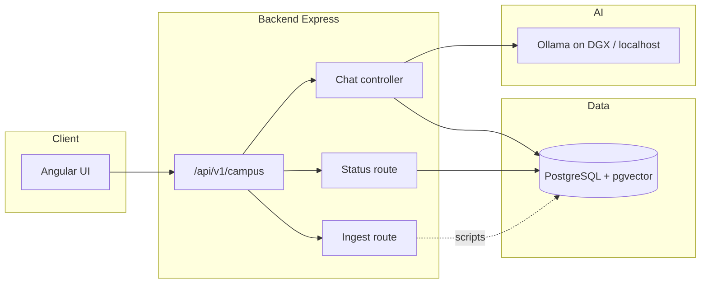

# MAPLE M3 — system architecture

```mermaid
flowchart LR
  subgraph client [Client]
    UI[Angular UI]
  end
  subgraph api [Backend Express]
    R["/api/v1/campus"]
    Chat[Chat controller]
    Status[Status route]
    Ingest[Ingest route]
  end
  subgraph ai [AI]
    Ollama[Ollama on DGX / localhost]
  end
  subgraph data [Data]
    PG[(PostgreSQL + pgvector)]
  end
  UI --> R
  R --> Chat
  R --> Status
  R --> Ingest
  Chat --> Ollama
  Chat --> PG
  Status --> PG
  Ingest -.->|scripts| PG
```
