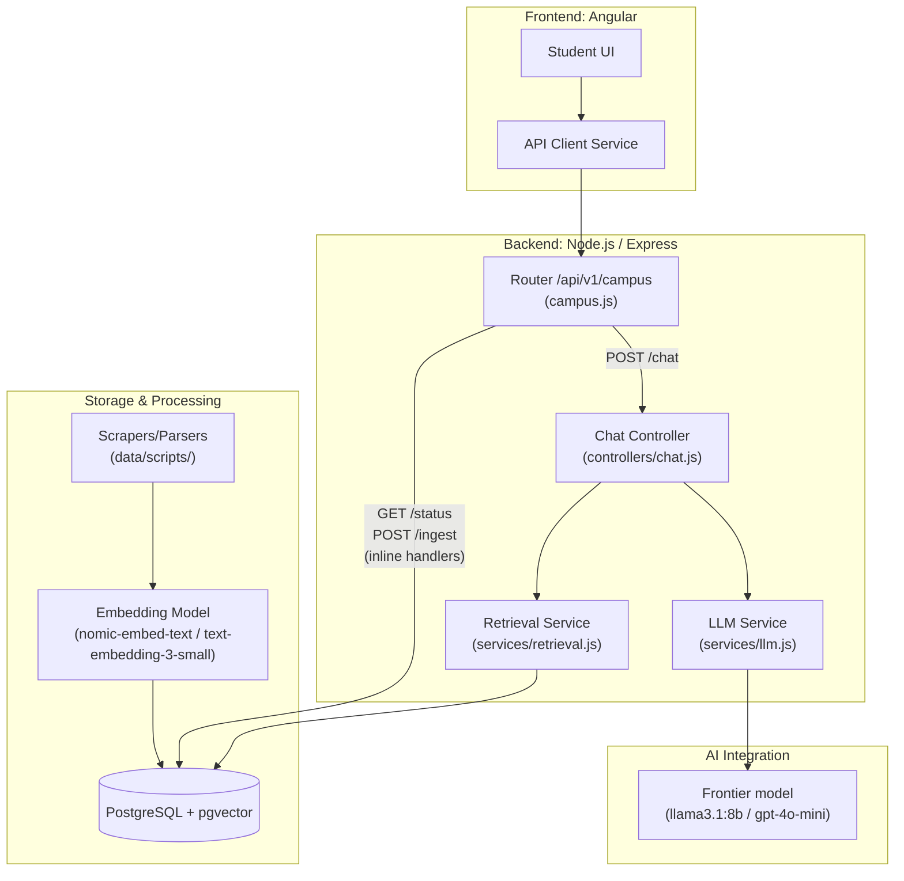

# MAPLE M3 — system architecture

This figure matches the [MAPLE M3 Project Design Doc](./MAPLE-M3-Project-Design-Doc.md#architecture-diagram) architecture diagram. The **AI Integration** label names the actual models in use (`llama3.1:8b` via Ollama on DGX Spark, or `gpt-4o-mini` via OpenAI, toggled by `USE_LOCAL_MODEL`).

**Route responsibilities:**
- **`POST /chat`** → Chat Controller → LLM Service + Retrieval Service → PostgreSQL + pgvector
- **`GET /status`** → inline handler in `campus.js` → queries `Documents` (`source_type = 'Events'`) directly via the shared pg Pool
- **`POST /ingest`** → inline handler in `campus.js` (requires Bearer token) → spawns `run-ingestion-batch.js` asynchronously → Scrapers → Embedding Model → PostgreSQL
