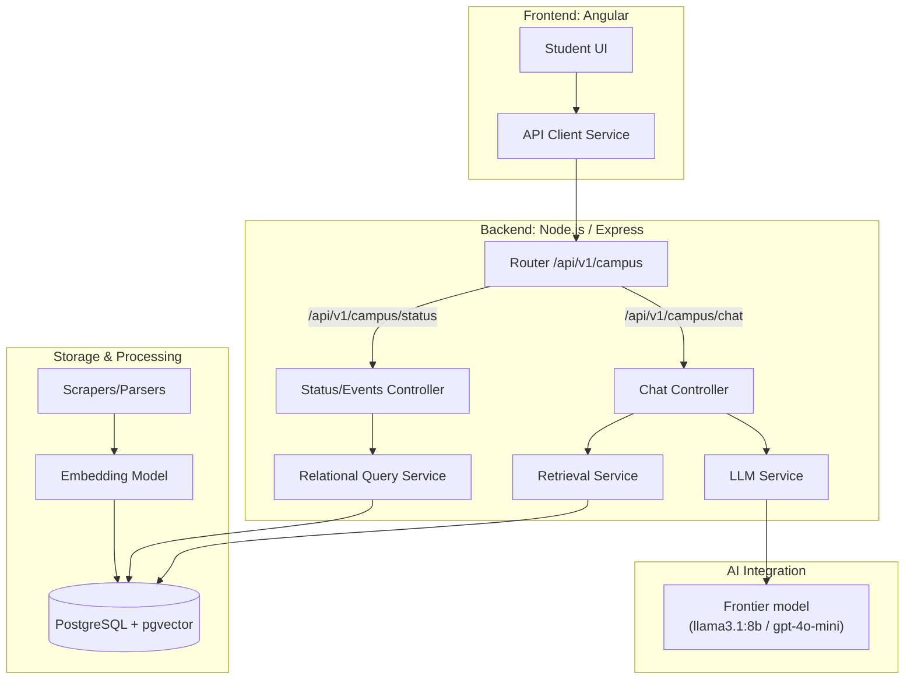

# MAPLE M3 — system architecture

This figure matches the **logical layout** of the [MAPLE M3 Project Design Doc](./MAPLE_M3%20Project%20Design%20Doc.md#architecture-diagram) architecture diagram; the only intentional difference is the **AI Integration** label, which names the **actual** models in use (Ollama on DGX / OpenAI) instead of the generic “cloud frontier” wording.

**Implementation note:** The Week 8 diagram did not depict **POST `/api/v1/campus/ingest`**; in the current codebase, that route triggers **Scrapers/Parsers** in the background and ultimately feeds the same **Embedding Model → PostgreSQL** path shown above.
